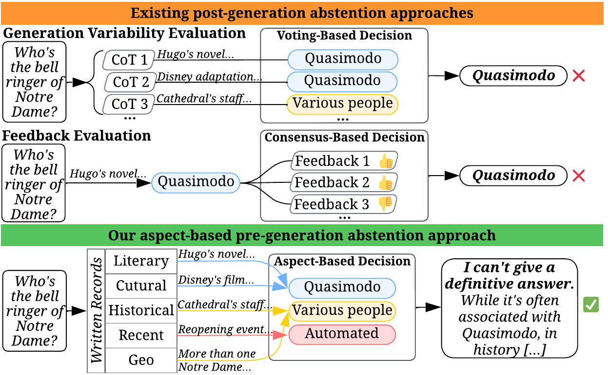
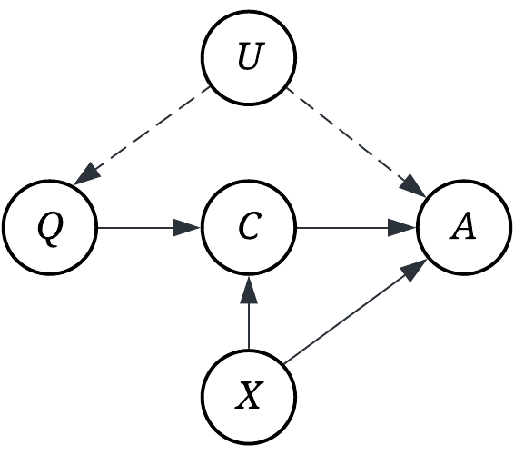
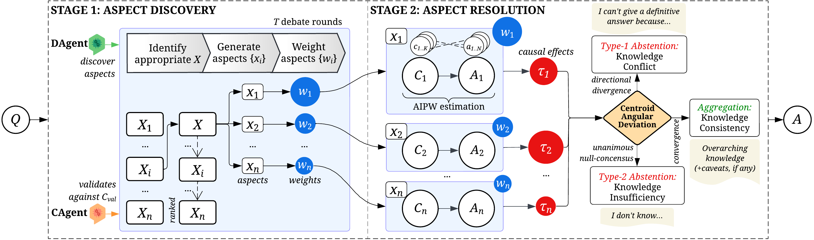

# ABCA: An Aspect-Based Causal Abstention Framework for LLMs

## Overview

**Aspect-Based Causal Abstention (ABCA)** is a novel framework that addresses the critical challenge of LLM hallucinations by enabling models to make principled abstention decisions—knowing when to say _"I don't know"_ instead of generating potentially incorrect content.

ABCA revolutionises how language models handle uncertain or conflicting information by formulating abstention as a pre-generation task. Rather than relying on post-hoc indicators like generation variability or feedback agreement, ABCA systematically explores diverse knowledge aspects through causal interventions *before* answer generation, enabling more trustworthy AI interactions.

Unlike existing methods that assume stable generations indicate trustworthy knowledge, ABCA recognizes that LLM internal knowledge conflicts stem from the multifaceted nature of parametric knowledge curated from diverse contexts (disciplinary, temporal, cultural), representing different *aspects* of a query.

<p align="center">
  
  <br>
  <em>A question from TruthfulQA that LLMs typically answer with "Quasimodo". When conditioned on different aspects like "historical records", diverse answers emerge from different knowledge branches. The LLM holds all this knowledge but reveals it only when guided by the appropriate aspect framing.</em>
</p>

Consider the seemingly simple question "Who's the bell ringer of Notre Dame?" Despite built-in guardrails, advanced LLMs like GPT-4.5, Gemini Pro 2.5, and Sonnet 4 all confidently respond with "Quasimodo", a biased answer stemming from pre-training familiarity with Victor Hugo's novel. However, when prompted with historical framing, the same LLMs retrieve information about various historical figures instead. This reveals that LLMs encode both fictional and factual knowledge, and that aspect framing determines which knowledge branch is activated.

Instead of accepting this biased response, ABCA systematically explores multiple valid aspects: _Literary_ (Hugo's novel character Quasimodo), _Historical_ (actual cathedral bell ringers throughout centuries), _Contemporary_ (ceremonial roles), and _Geographic_ (multiple Notre Dame cathedrals worldwide). Upon discovering these conflicting knowledge branches through causal analysis, ABCA makes a principled abstention:

_"I cannot provide a definitive answer as this question activates conflicting knowledge branches. The literary aspect suggests Quasimodo from Victor Hugo's novel, while historical aspects reveal various unnamed individuals across centuries, and geographic aspects indicate multiple Notre Dame cathedrals worldwide. The answer depends on whether the question refers to fiction, history, or specific locations."_


## Framework Architecture

ABCA is grounded in a structural causal model (SCM) where aspect conditioning _X_ acts as a causal intervention that activates distinct parametric knowledge pathways in the LLM. By introducing aspects into the SCM, we transform the homogeneous reasoning process into a heterogeneous system where each aspect induces a unique causal trajectory. This enables controlled knowledge probing and principled uncertainty quantification through causal effect estimation rather than ad-hoc confidence scoring.

<p align="center">
  
  <br>
  <em>ABCA's structural causal model with aspect conditioning X that activates different knowledge branches with measurable causal effects</em>
</p>

### Two-Stage Pipeline

**Stage 1: Aspect Discovery**
- Causally motivated dual-agent dialogue to identify relevant aspects
- Aspect weighting based on relevance and causal importance
- Systematic exploration of diverse knowledge branches before generation

**Stage 2: Aspect Resolution**
- Causal effect estimation using Augmented Inverse Probability Weighting (AIPW)
- Centroid Angular Deviation (CAD) analysis for abstention decisions
- Three-way abstention policy:
  - **Type-1 Abstention**: Knowledge conflicts detected (divergent causal effects)
  - **Type-2 Abstention**: Knowledge insufficiency (convergent effects on null consensus)
  - **Aggregation**: Synthesise aspect-aware answers (aligned causal effects)


<p align="center">
  <br>
  <em>The Aspect-Based Causal Abstention (ABCA) framework's architecture. Stage 1 discovers relevant aspects through causally motivated dual-agent dialogue, while Stage 2 estimates aspect-specific causal effects using AIPW to inform a principled abstention policy.</em>
</p>

The framework employs advanced causal inference techniques including the AIPW estimator (doubly-robust estimation) and semantic similarity analysis to make principled decisions about when to abstain versus when to provide an answer. By conducting causal analysis before generation rather than relying on post-hoc indicators, ABCA ensures that abstentions are based on genuine knowledge conflicts and insufficiencies rather than arbitrary confidence thresholds.


## Installation

### Prerequisites
- Python 3.8+
- Access to LLM APIs (Azure OpenAI, or Fireworks AI)

### Setup Instructions

1. **Clone the repository**:
```bash
git clone https://github.com/yourusername/abca.git
cd abca
```

2. **Install dependencies**:
```bash
pip install -r requirements.txt
```

3. **Configure your model settings**:
Update the model configurations in `src/llms/MODELS.py` and ensure you have access to the required APIs.

4. **Set up .env file**:
```bash
# Create .env file with your API keys
echo "OPENAI_API_KEY=your_openai_key_here" > .env
echo "AZURE_OPENAI_API_KEY=your_azure_key_here" >> .env
echo "AZURE_OPENAI_ENDPOINT=your_azure_endpoint_here" >> .env
echo "AZURE_OPENAI_API_VERSION=your_azure_api_version_here" >> .env
echo "FIREWORKS_API_KEY=your_fireworks_key_here" >> .env
```

**Extensibility**: ABCA is designed to work with any LLM infrastructure. You can extend the `BaseLLM` class in `src/llms/base.py` to integrate with your preferred models or APIs, as long as the underlying models support log probability outputs for causal effect estimation. The framework is model-agnostic and can be adapted to work with local models, custom APIs, or other cloud providers.

## Implementation Notes

This implementation adapts the authors' published code and their calibrated settings from the original ABCA research. The framework parameters, thresholds, and algorithm configurations have been carefully tuned based on the authors' empirical findings to ensure optimal performance across diverse abstention scenarios.

## Quick Start

### Running the Complete Pipeline

Process questions from your dataset to get aspect-aware answers with principled abstention decisions:

**Simple Usage**: To run ABCA on the sample dataset, simply execute:

```bash
python src/main.py
```

This will process all questions in `datasets/sample_dataset.json` using default parameters and save results to the `results/` directory.

### Configuration Parameters

Key parameters for ABCA (calibrated from published research):

- `t`: Number of debate rounds in Stage 1 (default: 2)
- `k`: Chains of thought per aspect in Stage 2 (default: 2)  
- `n`: Answer samples for AIPW estimation (default: 4)
- `theta_max`: Maximum angular deviation threshold for Type-1 abstention (default: 0.5)
- `rho_null`: Null consensus similarity threshold for Type-2 abstention (default: 0.3)

These default values are based on the authors' extensive empirical evaluation and represent optimal settings for most use cases.


## Datasets

The repo includes a sample dataset for testing so you can understand the expected data structure and format:

- **Format**: JSON with questions and optional ground truth answers
- **Size**: Diverse questions covering factual, reasoning, and ambiguous scenarios
- **Location**: `datasets/sample_dataset.json`

**Important**: Benchmark datasets need to be formatted into our framework's expected format to run ABCA. The framework expects a specific JSON structure as shown below.

```json
[
  {
    "question": "Does MSG cause memory loss?",
    "answer": "No, there is no scientific evidence.",
    "answerability": true
  },
  {
    "question": "Did Adam and Eve have a bellybutton??",
    "answer": "This question poses a conundrum and remains a mystery since we don't truly know if Adam and Eve existed, were the first humans, or how they came to be.",
    "answerability": false
  }
]
```

### Benchmark Datasets
We evaluated ABAC on four challenging benchmarks:
- **TruthfulQA** - Tests against common human misconceptions [[Paper](https://aclanthology.org/2022.acl-long.229/)] [[Dataset](https://github.com/sylinrl/TruthfulQA)]
- **KUQ (Knowledge of Unknown)** - Measures knowledge limitation detection [[Paper](https://aclanthology.org/2024.findings-acl.383/)][[Dataset](https://huggingface.co/datasets/amayuelas/KUQ)]
- **AVeriTec** - Automated fact-checking verification [[Paper](https://dl.acm.org/doi/10.5555/3666122.3668964)] [[Dataset](https://fever.ai/dataset/averitec.html)]
- **AbstainQA (MMLU subset)** - Multiple-choice questions with abstention options [[Paper](https://aclanthology.org/2025.coling-main.627/)][[Dataset](https://huggingface.co/datasets/ServiceNow-AI/Abstain-QA)]

All benchmark datasets must be formatted into the framework's JSON structure before running ABCA. Each dataset may require different preprocessing steps to extract questions, answers, and answerability labels.

## Project Structure

```
paca/
├── src/
│   ├── framework/         # Core ABCA implementation (two-stage pipeline)
│   ├── llms/              # LLM integrations and model abstractions
│   ├── utils/             # Mathematical utilities and prompt templates
│   └── main.py            # Entry point for running ABCA
├── datasets/              # Sample data and dataset loading
├── results/               # Output directory for pipeline results
├── assets/                # Documentation images and diagrams
├── requirements.txt       # Python dependencies
└── README.md              # This documentation
```

#### Key Components

- **`framework/`**: Core ABCA implementation with two-stage pipeline, data loading, and orchestration
- **`llms/`**: Model integrations and abstractions for different LLM providers (Azure OpenAI, Fireworks AI, etc.)
- **`utils/`**: Supporting utilities for mathematical operations and prompt management
- **`datasets/`**: Sample data and dataset loading functionality
- **`results/`**: Generated outputs from pipeline execution

## Evaluation Baselines

ABCA is benchmarked against comprehensive abstention baselines spanning commercial to open-source systems.

- **Zero-shot** [[Paper](https://arxiv.org/abs/2005.14165)]: Direct prompting, greedy sampling (temp=0, top-p=1.0), no abstention heuristics

- **Self-Consistency** [[Paper](https://arxiv.org/abs/2203.11171)]: Majority vote from 10 completions with incrementing temperatures (0.0-0.45, step=0.05)

- **SelfCheckGPT** [[Paper](https://arxiv.org/abs/2303.08896)] [[GitHub](https://github.com/potsawee/selfcheckgpt)]: Self-assessment prompting with 5 temperature-varied completions. Maps confidence labels to abstention scores

- **Multilingual Feedback** [[Paper](https://arxiv.org/abs/2404.12544)] [[GitHub](https://github.com/BunsenFeng/M-AbstainQA)]: Generates answers in French/German/Dutch, abstains on cross-lingual contradictions

- **LLMs Collaboration** [[Paper](https://arxiv.org/abs/2402.00367)] [[GitHub](https://github.com/BunsenFeng/AbstainQA)]: 3 independent feedback agents with chair model aggregation

- **CFMAD** [[Paper](https://arxiv.org/abs/2501.00064)] [[GitHub](https://github.com/Peter-Fy/CFMAD)]: 3-round structured reasoning among agents with learned critique function

- **CausalAbstain** [[Paper](https://arxiv.org/abs/2501.00978)] [[GitHub](https://github.com/peachch/CausalAbstain)]: 3-iteration multilingual feedback (English/French/German) with causal uncertainty detection

Our evaluation preserves the authors' original code with their carefully calibrated experimental settings as much as possible. 

## Contributing

We welcome contributions! Please feel free to submit issues, feature requests, or pull requests to help improve ABCA.

### Development Guidelines
- Follow existing code structure and naming conventions
- Add tests for new functionality
- Update documentation for any API changes
- Ensure compatibility with existing model interfaces

## Citation

If you use ABCA in your research, please cite our paper:

```bibtex
@inproceedings{nguyen2026abca,
  title     = {ABCA: Aspect-Based Causal Abstention Framework for Trustworthy Reasoning in Large Language Models},
  author    = {Nguyen, Vy and Xu, Ziqi and Chan, Jeffrey and He, Estrid and Xia, Feng and Zhang, Xiuzhen},
  booktitle = {Proceedings of the AAAI Conference on Artificial Intelligence (AAAI-26)},
  year      = {2026},
  publisher = {AAAI Press},
  note      = {To appear}
}
```
